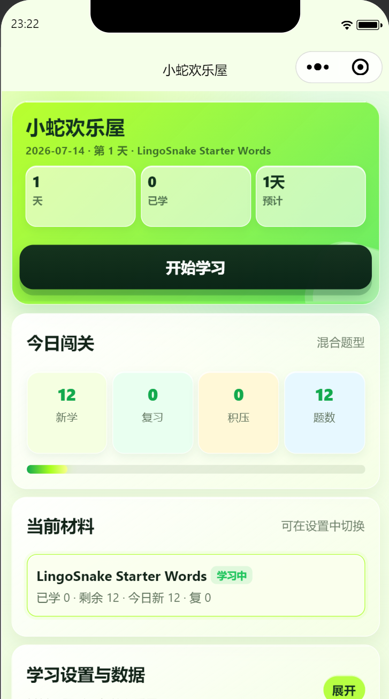
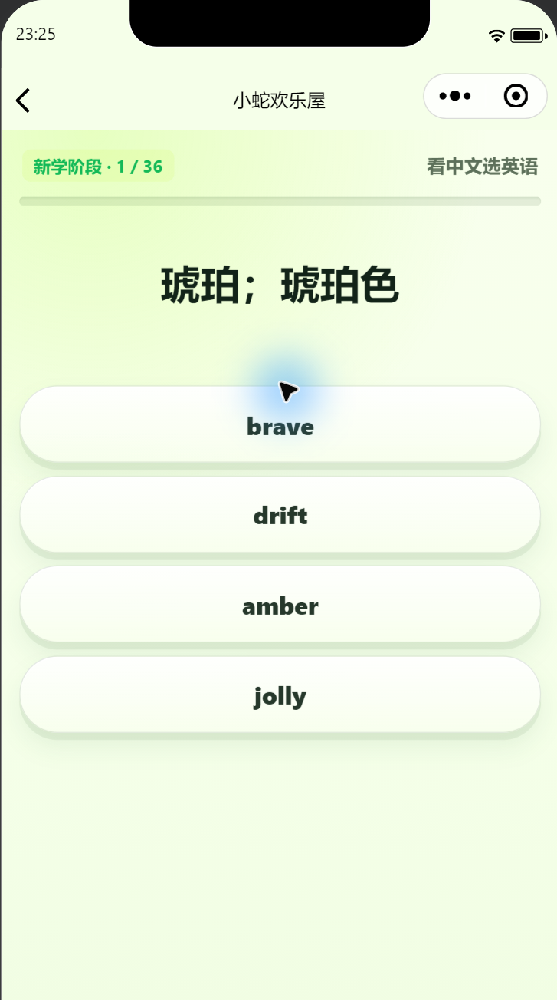

<div align="center">
  
  <h1>LingoSnake</h1>
  <p>A playful spaced-repetition vocabulary trainer for WeChat Mini Program.</p>
  <p><a href="README.zh-CN.md">简体中文</a> | English</p>
</div>

LingoSnake, known as **小蛇欢乐屋** in Chinese, turns daily vocabulary review into a bright, focused learning routine. It is designed for students who need a simple study plan, immediate answer feedback, and a clear record of what they have learned.

## Preview

| Home | Quiz |
| --- | --- |
|  |  |

The screenshots use the public sample vocabulary. No private curriculum data or personal learning records are included.

## Features

- Spaced repetition based on study days with intervals of 1, 2, 4, 7, 15, and 30 days.
- New-word and review limits that can be adjusted independently.
- Chinese-to-English, English-to-Chinese, phonetic-to-word, and mixed quiz modes.
- A-to-Z, Z-to-A, unit-based, and seeded random study order.
- Immediate visual, haptic, and distinct correct/wrong audio feedback.
- Learned-word history, dated wrong-answer book, and word-form relationships.
- Multiple vocabulary materials with isolated progress and settings.
- Local progress storage plus JSON backup/restore and CSV wrong-answer export.
- No runtime dependencies, accounts, analytics, or cloud services.

## Quick Start

### Requirements

- [Node.js 22](https://nodejs.org/) or newer
- [WeChat Developer Tools](https://developers.weixin.qq.com/miniprogram/dev/devtools/download.html)

### Run the Mini Program

```bash
git clone https://github.com/eoeac/lingosnake.git
cd lingosnake
npm run prepare
```

Before opening the repository root in WeChat Developer Tools, create a local project configuration:

```powershell
Copy-Item project.example.config.json project.config.json
```

`project.example.config.json` uses `touristappid` for the public sample only. To remove tourist-mode restrictions, replace it with your own AppID in the local `project.config.json`. The local file is ignored by Git and will never be committed to the public repository.

Run the complete local verification:

```bash
npm run check
```

## Vocabulary Data

The repository includes only a small original dataset in `data/sample/`. Full curriculum or textbook-derived vocabulary is intentionally excluded.

The preparation command validates the selected materials and writes an ignored CommonJS runtime module to `src/data/generated/`:

```bash
npm run prepare
```

### Use Private Vocabulary

1. Store authorized local material files under `private/vocabulary/`.
2. Copy `config/local.example.json` to `config/local.json`.
3. Set `vocabularySources` to one or more JSON files.
4. Run `npm run prepare` again.

Both `private/vocabulary/` and `config/local.json` are ignored by Git. The generated runtime module is ignored as well.

### Material Schema

Each source is a JSON array of materials:

```json
[
  {
    "id": "my-starter-words",
    "name": "My Starter Words",
    "defaultOrderMode": "unit",
    "words": [
      {
        "id": "starter-0001-bright",
        "index": 1,
        "word": "bright",
        "phonetic": "/braɪt/",
        "unit": "U1",
        "page": "1",
        "meanings": [
          { "pos": "adj.", "zh": "明亮的；聪明的" }
        ],
        "wordForms": "brightly adv. 明亮地 brightness n. 明亮"
      }
    ]
  }
]
```

Material IDs and word IDs must be unique. Every word needs a spelling and at least one non-empty Chinese meaning.

## Architecture

```text
src/
├─ core/       platform-independent learning logic
├─ pages/      WeChat pages and interactions
├─ utils/      storage and material adapters
├─ assets/     icons, avatar, and answer sounds
└─ data/       generated runtime materials

data/sample/   public original vocabulary
scripts/       data preparation and syntax checks
tests/         Node.js assertion tests
```

`src/core/` is the single source of truth for scheduling, quiz generation, ordering, word forms, exports, and session locking. The Mini Program and Node tests load the same CommonJS modules.

## Commands

```bash
npm run prepare  # validate and generate runtime vocabulary
npm test         # run all assertion tests
npm run check    # prepare data, check JavaScript syntax, and run tests
```

## Privacy And Security

- Learning progress stays in local WeChat storage unless the user exports it.
- Do not commit a personal AppID, `project.config.json`, `project.private.config.json`, private vocabulary, or generated materials.
- A client-side `.env` cannot protect a secret. API secrets must live on a server and must never be bundled into the Mini Program.
- Only redistribute vocabulary datasets for which you have permission.

## Contributing

1. Create a focused branch from `main`.
2. Add a failing test before changing behavior.
3. Run `npm run check`.
4. Open a pull request describing the user-facing impact and test evidence.

See [AGENTS.md](AGENTS.md) for repository-specific development rules.

## Roadmap

The current project intentionally targets native WeChat Mini Program. A future Web or multi-platform client may be rebuilt with **Taro**, reusing `src/core/` rather than reviving the deleted standalone Web implementation.

## License

[MIT](LICENSE) © 2026 LingoSnake contributors.
